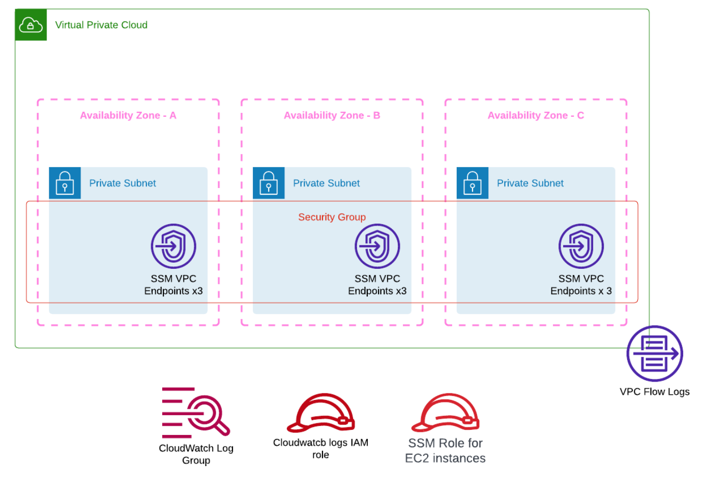

# Installation  

# Overview  

Please see blog site https://devbuildit.com/2023/02/06/security-checking-aws-infrastructure-code-before-deployment-with-checkov/ for detailed explaination of this repo contents.

This repo is in two section.  Folder "base-code" is the base infrastructure (see below) we deploy to demostrate some security concerns.

Folder "post-scan-updates" contains the updated code with improve security and notes on mitigrations.

## Requirements:
- AWS Account
- Terraform CLI installed with access to your target AWS account
- Checkov installed as detailed on https://checkov.io

## Deployment
- Clone repo into a source folder
- Run command 'Terraform init' in source folder
- Run command 'Terraform plan' in source folder
- Run Checkov security scan (see https://devbuildit.com for more details)
- Run command 'Terraform apply' in source folder and approve apply

